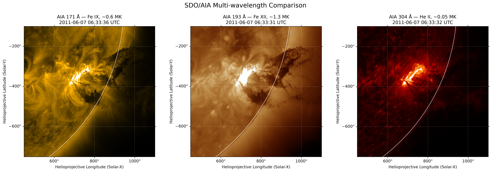
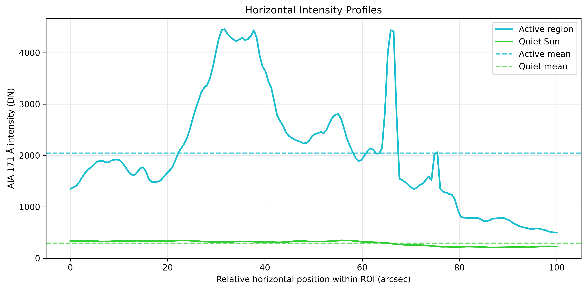
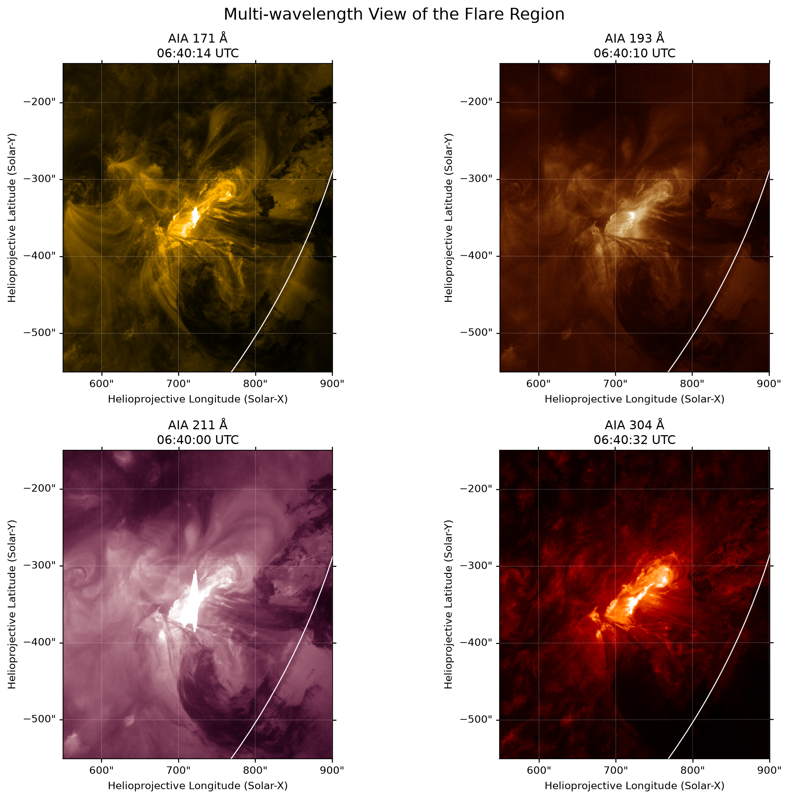
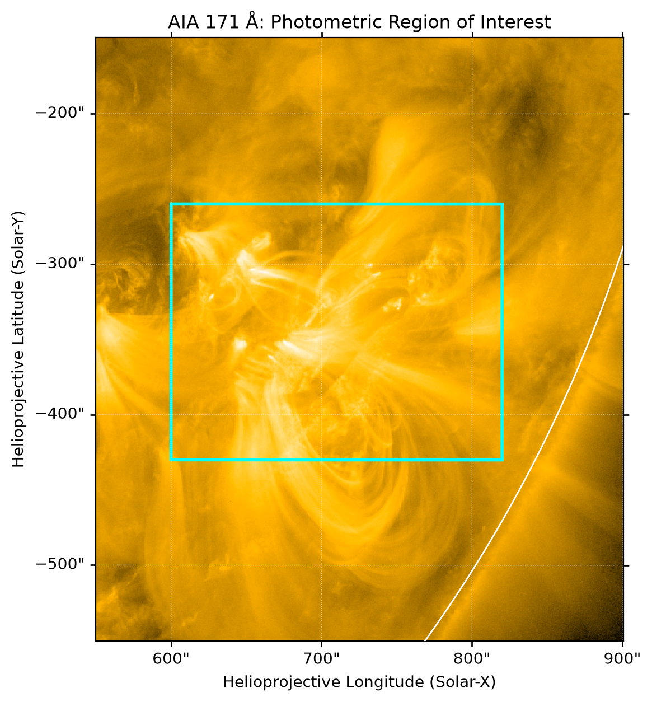
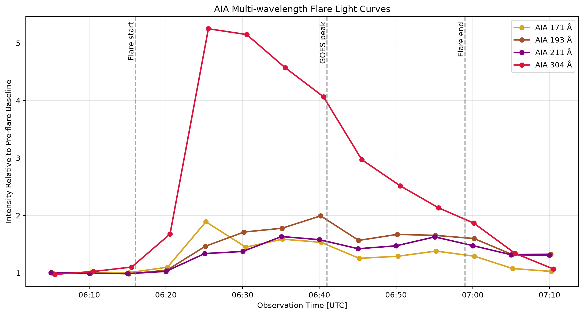
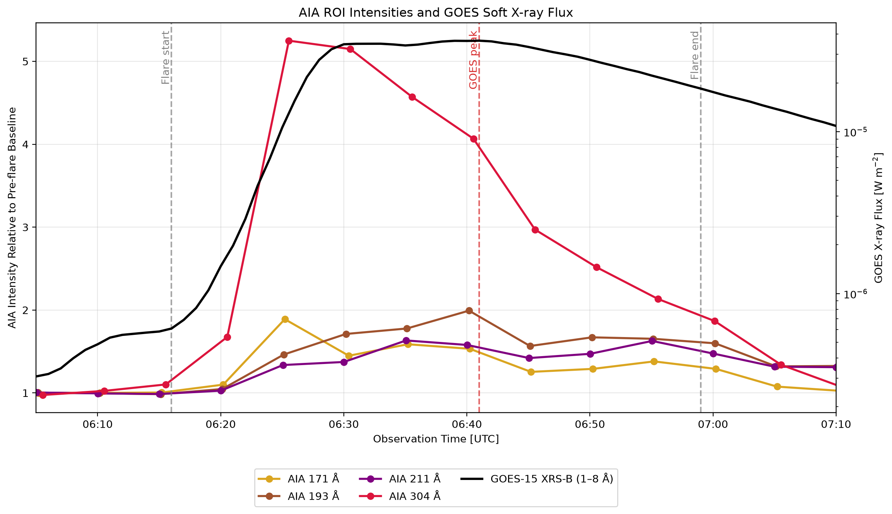

# SunProject

SunProject is a personal solar-data analysis project built with SunPy and publicly available solar observations.

The project began with basic SDO/AIA image processing and progressed to a time-series analysis of a solar flare.
The next stage focuses on eruptive solar events, connecting low-coronal evolution observed by SDO/AIA with CME propagation observed by coronagraphs such as SOHO/LASCO and STEREO/SECCHI, and eventually with associated solar radio emission.

## Project Goals

* Process solar FITS observations with SunPy
* Understand WCS and helioprojective solar coordinates
* Compare solar structures across multiple SDO/AIA channels
* Perform quantitative region-of-interest intensity analysis
* Analyze the temporal evolution of an active region and solar flare
* Identify and characterize eruptive solar events
* Track the evolution from low-coronal eruption to CME propagation
* Compare observations from SDO/AIA and coronagraphs such as SOHO/LASCO
* Explore multi-viewpoint observations with STEREO/SECCHI
* Investigate connections between CMEs, shocks, and solar radio bursts
* Maintain reproducible notebooks and research notes

## Project Progress

| Stage | Description | Status |
| --- | --- | --- |
| SunPy warm-up | FITS handling, metadata, coordinates, plotting, and submaps | Completed |
| AIA multi-wavelength warm-up | Channel comparison and ROI intensity statistics | Completed |
| Project 1 | Multi-wavelength evolution of the 2011 June 7 flare and comparison with GOES/XRS | Completed as a preliminary analysis |
| Eruptive-event study preparation | Review AIA analysis, learn CME observations and catalogs, and select a representative event | In progress |
| CME event study | Track an eruption from SDO/AIA into SOHO/LASCO C2/C3 observations | Planned |
| Multi-viewpoint analysis | Compare the event with STEREO/SECCHI COR2 observations when available | Planned |
| Solar-radio connection | Search for associated Type II/III radio bursts and connect them with the eruption/CME evolution | Planned |

## Repository Structure

```text
SunProject/
├── data/
│   └── .gitkeep
├── figures/
│   ├── aia_multiwavelength_comparison.png
│   ├── aia171_roi_intensity_profiles.png
│   ├── aia171_photometric_roi.png
│   ├── aia_flare_light_curves.png
│   ├── aia_flare_multiwavelength_morphology.png
│   └── aia_goes_light_curve_comparison.png
├── notebooks/
│   ├── 01_sunpy_warmup.ipynb
│   ├── SDO_AIA_warmup.ipynb
│   └── 02_aia_flare_evolution.ipynb
├── notes/
│   ├── next_questions.md
│   ├── sunpy_cheatsheet.md
│   ├── sunpy_warmup_summary.md
│   └── troubleshooting.md
├── .gitignore
└── README.md
```

## Notebooks

### `01_sunpy_warmup.ipynb`

This notebook introduces the basic SunPy workflow.

Main topics:

* Loading FITS files
* Creating SunPy maps
* Inspecting observation metadata
* Visualizing solar images with WCS
* Working with helioprojective coordinates
* Extracting image regions with `submap()`

### `SDO_AIA_warmup.ipynb`

This notebook uses SDO/AIA observations for introductory multi-wavelength and quantitative image analysis.

Main topics:

* Searching for AIA observations with `Fido`
* Exporting data through JSOC
* Comparing AIA 171, 193, and 304 Å images
* Extracting the same active region across multiple channels
* Comparing the representative temperature responses and structures of the channels
* Defining active-region and quiet-Sun ROIs
* Calculating ROI intensity statistics
* Constructing one-dimensional intensity profiles
* Checking for saturated pixels

### `02_aia_flare_evolution.ipynb`

This notebook analyzes the temporal and morphological evolution of the 2011 June 7 M2.5 flare.

Main topics:

* Selecting a flare event from HEK records
* Retrieving AIA time-series observations
* Matching observations to fixed target times
* Handling missing or offset sampling times
* Comparing flare morphology across four AIA channels
* Defining a photometric ROI
* Correcting intensity measurements for exposure time
* Constructing normalized multi-wavelength light curves
* Comparing sampled peak times and relative enhancements
* Retrieving and filtering GOES-15 XRS observations
* Comparing AIA ROI light curves with GOES soft X-ray flux
* Documenting the interpretation and limitations of the analysis

## Warm-up Analysis

### AIA Multi-wavelength Comparison



SDO/AIA observations near 06:33 UTC on 2011 June 7 were compared in the 171, 193, and 304 Å channels.

Each AIA passband emphasizes different plasma components and structures in the solar atmosphere.

| Channel   | Major contribution | Representative temperature | Commonly observed structures                     |
| --------- | ------------------ | -------------------------: | ------------------------------------------------ |
| AIA 171 Å | Fe IX              |       approximately 0.6 MK | Quiet corona and coronal loops                   |
| AIA 193 Å | Fe XII             |       approximately 1.3 MK | Hotter and more diffuse coronal structures       |
| AIA 304 Å | He II              |      approximately 0.05 MK | Chromosphere, transition region, and prominences |

These representative temperatures are simplified descriptions. Each AIA channel has a broad and sometimes multi-thermal temperature response, especially during solar flares.

The image colors are false colors assigned to the AIA channels and do not represent visible-light colors.

### Active-region and Quiet-Sun Intensity Comparison



Equal-sized active-region and quiet-Sun ROIs were compared in an AIA 171 Å image.

Results:

* Mean intensity ratio, active region divided by quiet Sun: **6.94**
* Median intensity ratio, active region divided by quiet Sun: **4.70**
* Detected saturated pixels in the active-region ROI: **167**
* Saturated-pixel fraction: **0.595%**

The active-region intensity profile contains strong variations and peaks associated with coronal loops and compact bright structures. The quiet-Sun profile is fainter and more uniform.

Because saturated pixels can increase the mean and standard deviation, the median was also used to compare the typical intensities of the two regions.

## Project 1: Multi-wavelength Evolution of a Solar Flare

Project 1 extends the single-image warm-up analysis into a time-series study of a specific solar flare.

The selected event is the M2.5 flare that occurred on 2011 June 7 in NOAA active region 11226.

### Event Information

| Property             | Value                                           |
| -------------------- | ----------------------------------------------- |
| Date                 | 2011 June 7                                     |
| GOES class           | M2.5                                            |
| NOAA active region   | 11226                                           |
| Flare start          | 06:16 UTC                                       |
| GOES peak            | 06:41 UTC                                       |
| Flare end            | 06:59 UTC                                       |
| Approximate location | Solar-X = 715.5 arcsec, Solar-Y = −339.8 arcsec |

### Data Selection

* AIA observation period: 06:05–07:10 UTC
* Approximate AIA sampling interval: 5 minutes
* AIA channels: 171, 193, 211, and 304 Å
* Number of selected AIA observations: 14 per channel
* AIA data series: `aia.lev1_euv_12s`
* AIA image segment: `image`
* GOES observation period: 05:30–07:30 UTC
* GOES instrument: GOES-15 XRS
* GOES channel: XRS-B, 1–8 Å
* GOES time resolution: 1-minute averages

The AIA channels were not always recorded at exactly the same time. For each target time, the nearest available observation was selected using the observation time stored in the FITS metadata.

A fixed sampling request occasionally omitted an otherwise available observation. In those cases, nearby times were searched without a sampling constraint, and the closest observation was added manually.

### Multi-wavelength Morphology



The four AIA channels show distinct structures in and around the flaring active region near the GOES soft X-ray peak.

The 171 Å image reveals detailed coronal loops around the bright flare core. The 193 and 211 Å images show enhanced emission from the central region and surrounding coronal structures. The 304 Å image displays relatively compact and elongated bright structures associated with the lower solar atmosphere.

### Photometric Region of Interest



A fixed photometric ROI was used to measure the integrated evolution of the flare core and nearby structures.

| Coordinate | Range               |
| ---------- | ------------------- |
| Solar-X    | 600–820 arcsec      |
| Solar-Y    | −430 to −260 arcsec |

For each observation, the mean intensity inside the ROI was divided by the exposure time. Each resulting light curve was then normalized by the mean of the first two pre-flare observations near 06:05 and 06:10 UTC.

### Multi-wavelength Light Curves



The AIA channels show different temporal responses during the flare.

The 171 and 304 Å intensities rise rapidly during the early phase of the event. The 193 Å intensity increases more gradually and remains enhanced until approximately the GOES soft X-ray peak. The 211 Å channel shows a more moderate and gradual variation.

### Sampled Peak Comparison

| Wavelength | Sampled peak time | Peak intensity relative to baseline |
| ---------: | :---------------: | ----------------------------------: |
|      171 Å |    06:25:12 UTC   |                                1.89 |
|      193 Å |    06:40:10 UTC   |                                1.99 |
|      211 Å |    06:35:03 UTC   |                                1.63 |
|      304 Å |    06:25:32 UTC   |                                5.25 |

The 171 and 304 Å channels reached their sampled maxima near 06:25 UTC. Their peak times differ by only 20 seconds, which is much shorter than the approximately five-minute sampling interval. Their peak order therefore cannot be resolved with the current data.

The 193 Å channel reached its sampled maximum approximately 50 seconds before the GOES soft X-ray peak. This difference is also shorter than the sampling interval, so the two maxima can be treated as approximately coincident at the temporal resolution of this analysis.

The 304 Å channel showed the largest relative enhancement, reaching 5.25 times its pre-flare baseline.

### Comparison with GOES Soft X-ray Flux



The AIA light curves were compared with the one-minute averaged GOES-15 XRS-B flux in the 1–8 Å band.

The 171 and 304 Å channels reached their sampled maxima approximately 15.8 and 15.5 minutes before the GOES soft X-ray maximum, respectively. Both maxima occurred during the rapid rise of the X-ray flux.

The 211 Å channel reached its sampled maximum approximately 6.0 minutes before the GOES maximum, when the soft X-ray flux was approaching its broad peak. The 193 Å channel reached its sampled maximum only 0.8 minutes before the GOES maximum and can therefore be regarded as approximately coincident with it at the temporal resolution of this analysis.

This comparison indicates that the sampled AIA maxima occurred during different phases of the soft X-ray evolution. The 171 and 304 Å enhancements were strongest during the rising phase, whereas the 193 Å maximum was most closely associated with the GOES soft X-ray maximum.

### Interpretation and Limitations

The different light curves are broadly consistent with the distinct temperature responses and emitting structures sampled by the AIA channels. However, each AIA passband has a broad and sometimes multi-thermal response. A channel should therefore not be interpreted as representing plasma at one exact temperature.

The relative peak amplitudes are not direct measurements of the relative energy emitted in the four channels. Each light curve was normalized by its own pre-flare baseline, and the channels have different instrumental responses and absolute intensity scales.

GOES/XRS measures the full-disk soft X-ray flux, whereas the AIA light curves were calculated from a selected active-region ROI. In addition, the AIA curves show intensities normalized to separate pre-flare baselines, while the GOES curve shows physical irradiance in W m^-2. Their amplitudes are therefore not directly comparable. The combined figure is used primarily to compare their temporal evolution.

The approximately five-minute AIA sampling interval limits the temporal precision of the analysis. Variations between the selected observations cannot be resolved, and sub-minute differences should not be interpreted as significant physical delays.

The results also depend on the size and position of the ROI. The selected region includes the flare core and surrounding coronal structures, so the light curves describe their combined evolution rather than emission from the flare kernel alone.

Bright pixels near the flare core may be saturated, although white regions in a displayed image can also result from plotting limits. Saturation must be checked separately before the peak intensity is interpreted quantitatively.

Finally, this preliminary analysis uses Level 1 AIA observations. More precise spatial and quantitative comparisons would require additional pointing correction, image registration, and calibration.

## Notes

* [`sunpy_warmup_summary.md`](notes/sunpy_warmup_summary.md): Summary of the main concepts covered during the warm-up
* [`sunpy_cheatsheet.md`](notes/sunpy_cheatsheet.md): Frequently used SunPy commands
* [`troubleshooting.md`](notes/troubleshooting.md): Errors encountered during the analysis and their solutions
* [`next_questions.md`](notes/next_questions.md): Questions for future analysis

## Data

The analyses use SDO/AIA FITS observations downloaded from JSOC and GOES-15 XRS observations provided by NOAA.

The observation files are not included in this repository because they can be downloaded again when needed. The warm-up, flare, and GOES data are stored locally in directories such as:

```text
data/
├── aia_multiwavelength/
├── aia/
│   └── 20110607/
│       ├── 171/
│       ├── 193/
│       ├── 211/
│       └── 304/
└── goes/
    └── 20110607/
```

The notebooks are executed from the `notebooks/` directory and use relative paths to access the data and figures.

```python
data_dir = Path("../data")
figure_dir = Path("../figures")
```

## Environment

The project uses the following Python packages:

* Python
* SunPy
* Astropy
* NumPy
* Matplotlib
* pandas
* DRMS
* h5netcdf
* h5py
* cdflib
* Jupyter

Activate the existing Conda environment and start Jupyter:

```bash
conda activate sun_env
jupyter notebook
```

When using VS Code, select `sun_env` as the Jupyter kernel.

## Reproducibility

The analysis cells were tested sequentially after restarting the Jupyter kernel.

The data-download cells are disabled by default to avoid submitting repeated JSOC or NOAA download requests. To reproduce the full workflow, download the required AIA and GOES observations first and then run the analysis cells using the local files.

JSOC exports depend on external server availability and may remain pending or fail temporarily. Individual failed downloads can be retried without repeating the complete export request.

Because the observation files are not stored in the repository, cloning the repository alone is not sufficient to reproduce the figures without downloading the corresponding data.

## Next Steps

The next phase of SunProject will move from flare-centered analysis toward an eruptive-event study connecting the low corona, CME propagation, and solar radio emission.

Planned workflow:

1. Review and consolidate the AIA analysis developed in Project 1.
2. Select a representative flare/eruption event for detailed study.
3. Record the GOES flare class, timing, active region, and source location.
4. Use SDO/AIA to identify the onset and morphology of the eruption.
5. Track filament, prominence, loop, and ejecta evolution in the low corona.
6. Identify the associated CME in SOHO/LASCO C2 observations.
7. Track the CME farther outward with LASCO C3.
8. Compare the event with CME catalog measurements such as first appearance time, position angle, width, and speed.
9. Examine STEREO/SECCHI COR2 observations when suitable data are available.
10. Search dynamic radio spectra for associated Type II and Type III bursts.
11. Investigate the physical connection between the eruption, CME-driven shock, and radio emission.
